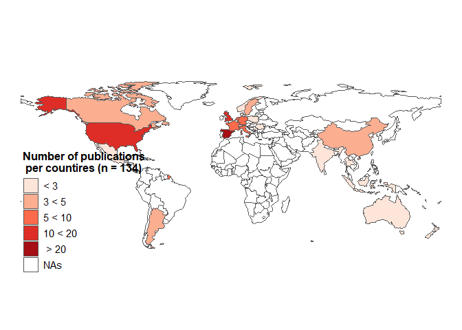

Graphic from article
================
Mathias Bellat
July, 23, 2024

# 00 Preparation

``` r
# 00 Preparation ---------------------------------------------------------------

# Folder check
getwd()

# Set folder direction
setwd(getwd())

# Clean up workspace
rm(list = ls(all.names = TRUE))

# Load packages
install.packages("pacman")
library(pacman) #Easier way of loading packages

# Specify required packages and download it if needed
pacman::p_load(dplyr, readr, ggalluvial, stringr, plyr, tibble, readxl, rnaturalearth, RColorBrewer)
```

``` r
#Show session infos
sessionInfo()
```

    ## R version 4.4.0 (2024-04-24 ucrt)
    ## Platform: x86_64-w64-mingw32/x64
    ## Running under: Windows 10 x64 (build 19045)
    ## 
    ## Matrix products: default
    ## 
    ## 
    ## locale:
    ## [1] LC_COLLATE=French_France.utf8  LC_CTYPE=French_France.utf8   
    ## [3] LC_MONETARY=French_France.utf8 LC_NUMERIC=C                  
    ## [5] LC_TIME=French_France.utf8    
    ## 
    ## time zone: Europe/Berlin
    ## tzcode source: internal
    ## 
    ## attached base packages:
    ## [1] stats     graphics  grDevices utils     datasets  methods   base     
    ## 
    ## other attached packages:
    ##  [1] knitr_1.48          RColorBrewer_1.1-3  rnaturalearth_1.0.1
    ##  [4] tibble_3.2.1        plyr_1.8.9          stringr_1.5.1      
    ##  [7] ggalluvial_0.12.5   ggplot2_3.5.1       readr_2.1.5        
    ## [10] dplyr_1.1.4         pacman_0.5.1       
    ## 
    ## loaded via a namespace (and not attached):
    ##  [1] utf8_1.2.4         generics_0.1.3     class_7.3-22       KernSmooth_2.23-22
    ##  [5] stringi_1.8.4      hms_1.1.3          digest_0.6.37      magrittr_2.0.3    
    ##  [9] evaluate_1.0.1     grid_4.4.0         fastmap_1.2.0      jsonlite_1.8.9    
    ## [13] e1071_1.7-16       DBI_1.2.3          httr_1.4.7         fansi_1.0.6       
    ## [17] scales_1.3.0       codetools_0.2-20   cli_3.6.3          crayon_1.5.3      
    ## [21] rlang_1.1.4        units_0.8-5        bit64_4.5.2        munsell_0.5.1     
    ## [25] withr_3.0.1        yaml_2.3.10        parallel_4.4.0     tools_4.4.0       
    ## [29] tzdb_0.4.0         colorspace_2.1-1   vctrs_0.6.5        R6_2.5.1          
    ## [33] proxy_0.4-27       lifecycle_1.0.4    classInt_0.4-10    bit_4.5.0         
    ## [37] vroom_1.6.5        pkgconfig_2.0.3    terra_1.7-83       pillar_1.9.0      
    ## [41] gtable_0.3.5       glue_1.7.0         Rcpp_1.0.13        sf_1.0-18         
    ## [45] xfun_0.48          tidyselect_1.2.1   rstudioapi_0.17.0  htmltools_0.5.8.1 
    ## [49] rmarkdown_2.28     compiler_4.4.0

## 01 Import data sets

``` r
# 01 Import data sets ----------------------------------------------------------
# 01.1 Import the metada infos ################################################

info <- read_delim("./ML_archaeology_metadata.csv", delim = ";")
```

| ID    | Name                          | Year | Authors                                                                        | Tittle                                                                                                    | Abstract                                                                                                                                                                                                                                                                                                                                                                                                                                                                                                                                                                                                                                                                                                                                                                                                                                                                                                                                                                                                                                                                                                                                                                                                                                                                                                                                                                                                                                                                                                                                         | Country of affiliation | Journal                                        | Open Access |
|:------|:------------------------------|-----:|:-------------------------------------------------------------------------------|:----------------------------------------------------------------------------------------------------------|:-------------------------------------------------------------------------------------------------------------------------------------------------------------------------------------------------------------------------------------------------------------------------------------------------------------------------------------------------------------------------------------------------------------------------------------------------------------------------------------------------------------------------------------------------------------------------------------------------------------------------------------------------------------------------------------------------------------------------------------------------------------------------------------------------------------------------------------------------------------------------------------------------------------------------------------------------------------------------------------------------------------------------------------------------------------------------------------------------------------------------------------------------------------------------------------------------------------------------------------------------------------------------------------------------------------------------------------------------------------------------------------------------------------------------------------------------------------------------------------------------------------------------------------------------|:-----------------------|:-----------------------------------------------|:------------|
| ID001 | Nguifo et al. 1997            | 1997 | Nguifo, EM; Lagrange, MS; Renaud, M; Sallantin, J                              | PLATA: An application of LEGAL, a machine learning based system, to a typology of archaeological ceramics | The authors here show that machine learning techniques can be used for designing an archaeological typology, at an early stage when the classes are not yet well defined. The program (LEGAL, LEarning with GAlois Lattice) is a machine learning system which uses a set of examples and counter-examples in order to discriminate between classes. Results show a good compatibility between the classes such as they are defined by the system and the archaeological hypotheses.                                                                                                                                                                                                                                                                                                                                                                                                                                                                                                                                                                                                                                                                                                                                                                                                                                                                                                                                                                                                                                                             | FRA                    | Computers and the Humanities                   | Yes         |
| ID002 | O’Sullivan and Haklay 2000    | 2000 | O’Sullivan, D; Haklay, M                                                       | Agent-based models and individualism: is the world agent-based?                                           | Agent-based models (ABMs) are an increasingly popular tool in the social sciences. This trend seems likely to continue, so that they will become widely used in geography and in urban and regional planning. We present an overview of examples of these models in the life sciences, economics, planning, sociology, and archaeology. We conclude that ABMs strongly tend towards an individualist view of the social world. This point is reinforced by closer consideration of particular examples. This discussion pays attention to the inadequacy of an individualist model of society with reference to debates in social theory. We argue that because models are closed representations of an open world it is important that institutions and other social structures be explicitly included, or that their omission be explained. A tentative explanation for the bias of ABMs is offered, based on an examination of early research in artificial intelligence and distributed artificial intelligence from which disciplines the approach is derived. Some implications of these findings are discussed. We indicate some useful research directions which are beginning to tackle the individualism issue directly. We further note that the underlying assumptions of ABMs are often hidden in the implementation details. We conclude that such models must be subject to critical examination of their assumptions, and that model builders should engage with social theory if the approach is to realise its full potential. | GBR                    | Environnement and Planning A-Economy and Space | No          |
| ID003 | Amigoni and Schiaffonati 2009 | 2009 | Amigoni, F; Schiaffonati, V                                                    | THE MINERVA SYSTEM: A STEP TOWARD AUTOMATICALLY CREATED VIRTUAL MUSEUMS                                   | The application of artificial intelligence (AI) tools to cultural heritage yields new technological solutions for the fruition of museums and art exhibitions. In this article we present the latest version of the Minerva system, able to support the organization of virtual museums by cooperating with curators to set a collection of works of art in an environment. The new version of Minerva organizes a part of the arche-ological finds belonging to the collection of the Archeological Museum of Milan. The role of Minerva is not to substitute the curators but to assist them in setting up a museum or an art exhibition. In this perspective, Minerva carries out automatically some tasks involved in museum organization and constitutes a unique system among those oriented to cultural heritage. The experimental activities have been conducted in cooperation with archeological experts who validated the results produced by Minerva.                                                                                                                                                                                                                                                                                                                                                                                                                                                                                                                                                                                | ITA                    | Applied Artificial Intelligence,               | Yes         |
| ID004 | Boon et al. 2009-1            | 2009 | Boon, Paul; van Der Maaten, Laurens; Paijmans, Hans; Postma, Eric; Lange, Guus | Digital Support for Archaeology                                                                           | We describe an interdisciplinary approach in which computer scientists develop techniques to support archaeology. In the Reading Images for the Cultural Heritage ( RICH) project, a variety of methods have been developed to support archaeologists in the visualization, categorization, and characterization of archaeological objects, such as medieval glass, coins, ceramics, and seeds. The methods are based on image processing and machine learning algorithms that are tailored to the task at hand. We describe the algorithms and illustrate their application on archaeological datasets. The virtues and pitfalls of the interdisciplinary approach to archaeology are discussed.                                                                                                                                                                                                                                                                                                                                                                                                                                                                                                                                                                                                                                                                                                                                                                                                                                                | NLD                    | Interdisciplinary Science Reviews              | No          |
| ID005 | Toler et al. 2010             | 2010 | Toler-Franklin, C; Brown, B; Weyrich, T; Funkhouser, T; Rusinkiewicz, S        | Multi-Feature Matching of Fresco Fragments                                                                | We present a multiple-feature approach for determining matches between small fragments of archaeological artifacts such as Bronze-Age and Roman frescoes. In contrast with traditional 2D and 3D shape matching approaches, we introduce a set of feature descriptors that are based on not only color and shape, but also normal maps. These are easy to acquire and combine high data quality with discriminability and robustness to some types of deterioration. Our feature descriptors range from general-purpose to domain-specific, and are quick to compute and match. We have tested our system on three datasets of fresco fragments, demonstrating that multi-cue matching using different subsets of features leads to different tradeoffs between efficiency and effectiveness. In particular, we show that normal-based features are more effective than color-based ones at similar computational complexity, and that 3D features are more discriminative than ones based on 2D or normals, but at higher computational cost. We also demonstrate how machine learning techniques can be used to effectively combine our new features with traditional ones. Our results show good retrieval performance, significantly improving upon the match prediction rate of state-of-the-art 3D matching algorithms, and are expected to extend to general matching problems in applications such as texture synthesis and forensics.                                                                                                   | USA                    | Acm Transactions on Graphics                   | No          |

Infos table

``` r
# 01.2 Import the observations #################################################
obs <- read_delim("./ML_archaeology_info.csv", delim = ";", na = "")
```

| Name                          | ID    | Date | Algorithms | Architecture                         | Field                                            | Evaluation     | Task                    | Input              | Results      |
|:------------------------------|:------|-----:|:-----------|:-------------------------------------|:-------------------------------------------------|:---------------|:------------------------|:-------------------|:-------------|
| Nguifo et al. 1997            | ID001 | 1997 | LEGAL      | Decision Trees and Rule Induction    | Classification (of material) and Typology        | Classification | Artefact Classification | Small Scale Images | Successful   |
| O’Sullivan and Haklay 2000    | ID002 | 2000 | NA         | NA                                   | NA                                               | NA             | NA                      | NA                 | NA           |
| Amigoni and Schiaffonati 2009 | ID003 | 2009 | NA         | NA                                   | NA                                               | NA             | NA                      | NA                 | NA           |
| Boon et al. 2009-1            | ID004 | 2009 | TiMBL      | Unsupervised Learning and Clustering | Conservation and Cataloguing                     | Classification | Text Extraction         | Text Data          | Unsuccessful |
| Boon et al. 2009-2            | ID004 | 2009 | NA         | NA                                   | Classification (of material) and Typology;Theory | Theory         | Theory                  | Theory             | NA           |

Observation table

``` r
# 01.3 Remove non reviewed papers ##############################################

# Reviewed and not reviewed papers, one papers might have several studies
not_review <- subset(obs, is.na(obs$Evaluation == TRUE) | obs$Evaluation  == "Theory")
review <- subset(obs, obs$Evaluation != "NA" & obs$Evaluation != "Theory")

# Merge with metadata
merge <- merge(info, not_review, by = "ID")

# Select papers which have several studies to not remove them in case one of their study do fit review protocol
df.1 <- merge[grep("-1", merge$Name.y, ignore.case = TRUE ),]
df.2 <- merge[grep("-2", merge$Name.y, ignore.case = TRUE ),]
df <- rbind(df.1, df.2)

# Select the papers in question and unlist them from the papers to remove
ID <- c(df$ID)
not_review <- merge[!merge$ID %in% ID, ]
head(not_review)
```

    ##      ID                        Name.x Year
    ## 1 ID002    O'Sullivan and Haklay 2000 2000
    ## 2 ID003 Amigoni and Schiaffonati 2009 2009
    ## 4 ID006      Barcelo and Almeida 2012 2012
    ## 5 ID007          Praisler et al. 2013 2013
    ## 6 ID011       Andrew and Shepard 2017 2017
    ## 7 ID012              Drap et al. 2017 2017
    ##                                                    Authors
    ## 1                                 O'Sullivan, D; Haklay, M
    ## 2                              Amigoni, F; Schiaffonati, V
    ## 4                              Barcelo, JA; de Almeida, VM
    ## 5 Praisler, Mirela; Domnisoru, Danieal; Domnisoru, Leonard
    ## 6                                 Andrew, ME; Shephard, JM
    ## 7   Drap, P; Papini, O; Pruno, E; Nucciotti, M; Vannini, G
    ##                                                                                                                                       Tittle
    ## 1                                                                            Agent-based models and individualism: is the world agent-based?
    ## 2                                                                    THE MINERVA SYSTEM: A STEP TOWARD AUTOMATICALLY CREATED VIRTUAL MUSEUMS
    ## 4                                                   Functional analysis from visual and non-visual data. An artificial intelligence approach
    ## 5                                         Chemometric method for the automated identification of cucuteni ceramics based on ATR-FTIR spectra
    ## 6 Semi-automated detection of eagle nests: an application of very high-resolution image data and advanced image analyses to wildlife surveys
    ## 7                             Ontology-Based Photogrammetry Survey for Medieval Archaeology: Toward a 3D Geographic Information System (GIS)
    ##                                                                                                                                                                                                                                                                                                                                                                                                                                                                                                                                                                                                                                                                                                                                                                                                                                                                                                                                                                                                                                                                                                                                                                                                                                                                                                                                                                                                                                                                                                                                                                                                                                                                                                                                                                                                                                                                                                                                                                                                                                                                                                                                                                                                                                                                                                                                                                                                                                                                                                        Abstract
    ## 1                                                                                                                                                                                                                                                                                                                                                                                                                                                                                                                                                                                                                                                                                                                                                                                                                                                                                                                                                              Agent-based models (ABMs) are an increasingly popular tool in the social sciences. This trend seems likely to continue, so that they will become widely used in geography and in urban and regional planning. We present an overview of examples of these models in the life sciences, economics, planning, sociology, and archaeology. We conclude that ABMs strongly tend towards an individualist view of the social world. This point is reinforced by closer consideration of particular examples. This discussion pays attention to the inadequacy of an individualist model of society with reference to debates in social theory. We argue that because models are closed representations of an open world it is important that institutions and other social structures be explicitly included, or that their omission be explained. A tentative explanation for the bias of ABMs is offered, based on an examination of early research in artificial intelligence and distributed artificial intelligence from which disciplines the approach is derived. Some implications of these findings are discussed. We indicate some useful research directions which are beginning to tackle the individualism issue directly. We further note that the underlying assumptions of ABMs are often hidden in the implementation details. We conclude that such models must be subject to critical examination of their assumptions, and that model builders should engage with social theory if the approach is to realise its full potential.
    ## 2                                                                                                                                                                                                                                                                                                                                                                                                                                                                                                                                                                                                                                                                                                                                                                                                                                                                                                                                                                                                                                                                                                                                                                                                                                                                                                                                                                                                                                                                                                                                             The application of artificial intelligence (AI) tools to cultural heritage yields new technological solutions for the fruition of museums and art exhibitions. In this article we present the latest version of the Minerva system, able to support the organization of virtual museums by cooperating with curators to set a collection of works of art in an environment. The new version of Minerva organizes a part of the arche-ological finds belonging to the collection of the Archeological Museum of Milan. The role of Minerva is not to substitute the curators but to assist them in setting up a museum or an art exhibition. In this perspective, Minerva carries out automatically some tasks involved in museum organization and constitutes a unique system among those oriented to cultural heritage. The experimental activities have been conducted in cooperation with archeological experts who validated the results produced by Minerva.
    ## 4                                                                                                                                                                                                                                                                                                                                                            Why archaeological artefacts are the way they are? In this paper we try to solve such a question by investigating the relationship between form and function. We propose new ways of studying the way behaviour in the past can be asserted on the examination of archaeological observables in the present. In any case, we take into account that there are also non-visual features characterizing ancient objects and materials (i.e., compositional information based on mass spectrometry data, chronological information based on radioactive decay measurements, etc.). Information that should make us aware of many functional properties of objects is multidimensional in nature: size, which makes reference to height, length, depth, weight and mass; shape and form, which make reference to the geometry of contours and volumes; texture, which refers to the microtopography (roughness, waviness, and lay) and visual appearance (colour variations, brightness, reflectivity and transparency) of surfaces; and finally material, meaning the combining of distinct compositional elements and properties to form a whole. With the exception of material data, the other relevant aspects for functional reasoning have been traditionally described in rather ambiguous terms, without taking into account the advantages of quantitative measurements of shape/form, and texture. Reasoning about the functionality of archaeological objects recovered at the archaeological site requires a cross-disciplinary investigation, which may also range from recognition techniques used in computer vision and robotics to reasoning, representation, and learning methods in artificial intelligence. The approach we adopt here is to follow current computational theories of object perception to ameliorate the way archaeology can deal with the explanation of human behaviour in the past (function) from the analysis of visual and non-visual data, taking into account that visual appearances and even compositional characteristics only constrain the way an object may be used, but never fully determine it.
    ## 5                                                                                                                                                                                                                                                                                                                                                                                                                                                                                                                                                                                                                                                                                                                                                                                                                                                                                                                                                                                                                                                                                                                                                                                                                                                                                                                                                                                                                                                                                                                                                                                                                                                                                                                                               A chemometric software application was developed in order to obtain an automatic identification of original Cucuteni ceramic artifacts and distinguish them from fake ceramic samples similar to those found on the black market. The software application is based on Principal Component Analysis (PCA), a method of artificial intelligence that allowed us to build multivariate models that can be used for the efficient spectral discrimination of genuine Cucuteni ceramic samples. The spectra obtained by Fourier Transform Infrared Spectroscopy with ATR-Attenuated Total Reflection (FTIR-ATR) for a set of Cucuteni ceramic samples discovered in archaeological sites from Moldova Romania were used as input database for the detection system.
    ## 6                                                                                                                                                                                                                                                                                                Very high-resolution (VHR) image data, including from unmanned aerial vehicle (UAV) platforms, are increasingly acquired for wildlife surveys. Animals or structures they build (e.g. nests) can be photointerpreted from these images, however, automated detection is required for more efficient surveys. We developed semi-automated analyses to map white-bellied sea eagle (Haliaeetus leucogaster) nests in VHR aerial photographs of the Houtman Abrolhos Islands, Western Australia, an important breeding site for many seabird species. Nest detection is complicated by high environmental heterogeneity at the scale of nests (similar to 1-2 m), the presence of many features that resemble nests and the variability of nest size, shape and context. Finally, the rarity of nests limits the availability of training data. These challenges are not unique to wildlife surveys and we show how they can be overcome by an innovative integration of object-based image analyses (OBIA) and the powerful machine learning one-class classifier Maxent. Maxent classifications using features characterizing object texture, geometry and neighborhood, along with limited object color information, successfully identified over 90% of high quality nests (most weathered and unusually shaped nests were also detected, but at a slightly lower rate) and labeled <2% of objects as candidate nests. Although this overestimates the occurrence of nests, the results can be visually screened to rule out all but the most likely nests in a process that is simpler and more efficient than manual photointerpretation of the full image. Our study shows that semi-automated image analyses for wildlife surveys are achievable. Furthermore, the developed strategies have broad relevance to image processing applications that seek to detect rare features differing only subtly from a heterogeneous background, including remote sensing of archeological remains. We also highlight solutions to maximize the use of imperfect or uncalibrated image data, such as some UAV-based imagery and the growing body of VHR imagery available in Google Earth and other virtual globes.
    ## 7 This paper presents certain reflections concerning an interdisciplinary project between medieval archaeologists from the University of Florence (Italy) and computer science researchers from CNRS, National Center for Scientific Research, (France), aiming towards a connection between 3D spatial representation and archaeological knowledge. We try to develop an integrated system for archaeological 3D survey and all other types of archaeological data and knowledge by incorporating observable (material) and non-graphic (interpretive) data. Survey plays a central role, since it is both a metric representation of the archaeological site and, to a wider extent, an interpretation of it (being also a common basis for communication between the two teams). More specifically, 3D survey is crucial, allowing archaeologists to connect actual spatial assets to the stratigraphic formation processes (i.e., to the archaeological time) and to translate spatial observations into historical interpretation of the site. It is well known that laser scanner, photogrammetry and computer vision are very useful tools for archaeologists, although the integration of the representation of space, as well as archaeological time has not yet found a methodological standard of reference. We propose a common formalism for describing photogrammetric survey and archaeological knowledge stemming from ontologies: indeed, ontologies are fully used to model and store 3D data and archaeological knowledge. We equip this formalism with a qualitative representation of time, starting from archaeological stratigraphy. Stratigraphic analyses (both of excavated deposits and of upstanding structures) are closely related to Edward Cecil Harris's theory of the \\Unit of Stratigraphication\\\\ (referred to as \\\\"US\\\\", while a stratigraphic unit of an upstanding structure Unita Stratigrafica Murale, in Italian, will be referred to as \\\\"USM\\\\"). Every US is connected to the others by geometric, topological and, eventually, temporal links, and these are recorded by the 3D photogrammetric survey. However, the limitations of the Harris matrix approach led us to use another formalism for representing stratigraphic relationships, namely Qualitative Constraints Networks (QCN), which was successfully used in the domain of knowledge representation and reasoning in artificial intelligence for representing temporal relations.\\""
    ##   Country of affiliation                                        Journal
    ## 1                    GBR Environnement and Planning A-Economy and Space
    ## 2                    ITA               Applied Artificial Intelligence,
    ## 4                    ESP    Mediterranean Archaeology and Archaeometry,
    ## 5                    ROU       European Journal of Science and Theology
    ## 6                    AUS     Remote Sensing in Ecology and Conservation
    ## 7                    FRA                                    Geosciences
    ##   Open Access                        Name.y Date Algorithms Architecture
    ## 1          No    O'Sullivan and Haklay 2000 2000       <NA>         <NA>
    ## 2         Yes Amigoni and Schiaffonati 2009 2009       <NA>         <NA>
    ## 4         Yes      Barcelo and Almeida 2012 2012       <NA>         <NA>
    ## 5         Yes          Praisler et al. 2013 2013       <NA>         <NA>
    ## 6         Yes       Andrew and Shepard 2017 2017       <NA>         <NA>
    ## 7         Yes              Drap et al. 2017 2017       <NA>         <NA>
    ##                          Field Evaluation   Task  Input Results
    ## 1                         <NA>       <NA>   <NA>   <NA>    <NA>
    ## 2                         <NA>       <NA>   <NA>   <NA>    <NA>
    ## 4 Cognitive Archaeology;Theory     Theory Theory Theory    <NA>
    ## 5                         <NA>       <NA>   <NA>   <NA>    <NA>
    ## 6                         <NA>       <NA>   <NA>   <NA>    <NA>
    ## 7                         <NA>       <NA>   <NA>   <NA>    <NA>

``` r
# Create the reviewed metadata file
ID <- c(not_review$ID)
metadata <- info[!info$ID %in% ID, ]

# Show how many papers were included in the review and how many not

# Reviewed paper
nrow(metadata)
```

    ## [1] 134

``` r
# Number of studies
nrow(review)
```

    ## [1] 146

``` r
# Not reviewed paper
nrow(not_review)
```

    ## [1] 64

## 02 Basics statistics

``` r
# 02 Basics statistics ---------------------------------------------------------
# 02.1 Year of publication graph ###############################################
pub <- table(metadata$Year)
pub <- as.data.frame(pub)
colnames(pub) <- c("year","Freq")
pub$year <- as.numeric(as.character(pub$year))

# Left join df years to all years
df1 <- join(data.frame(year = 1997:2022), pub)   
df1[is.na(df1$Freq), "Freq"] <- 0

# Create the plot
plot <- ggplot(subset(df1, Freq != 0), aes(x = year, y = Freq))+
  geom_rect( xmin = 2019, xmax = 2022,  ymin = -Inf,
             ymax = Inf,  fill = "lightblue",  alpha = 0.03) +
  coord_cartesian(xlim =c(1997, 2023), ylim = c(0, 50)) +
  geom_line(color = "black", linewidth = 0.75) +  labs(x = "Years", y = paste0("Number of publications (n = ", sum(df1$Freq),")")) +
  geom_text(aes(label = round(Freq, 2)), vjust = -0.95, hjust = 0.95) +
  geom_point(shape=21, color="black", fill="#69b3a2", size=4) +
  scale_x_continuous(breaks = seq(2000, max(df1$year), by = 5)) +
  theme_classic()

# Check the plot
plot 
```

<!-- -->

``` r
# Export the plot  
ggsave("./Export/Graph/Figure_03.png", plot = plot, width = 7, height = 6, units = "in", dpi = 600)
ggsave("./Export/Graph/Figure_03.pdf", plot = plot, width = 7, height = 6, units = "in")
```

``` r
# 02.2 Country list ############################################################
countries <- table(metadata$`Country of affiliation`)
countries <- as.data.frame(countries)
countries$Var1 <- as.character(countries$Var1)

# Get world map data
world <- merge(ne_countries(), countries, by.x = "iso_a3_eh", by.y = "Var1", all.x = TRUE)

# remove antarctica
world <- world[!world$iso_a3 %in% c("ATA"),]

# Manually specify breaks for creating categories
custom_breaks <- c(1, 3, 5, 10, 20, max(na.omit(world$Freq)))  # Adjust the breaks as needed
world$categories <- cut(world$Freq, breaks = custom_breaks, include.lowest = TRUE)
red_palette <- brewer.pal(5, "Reds")

# Create the plot
plot <- ggplot() +
  geom_sf(data = world, aes(fill = categories)) +
  labs(fill =  paste0("Number of publications \n per countires (n = ",nrow(metadata),")")) +
  scale_fill_manual(values = red_palette,na.value = "white",  labels=c("< 3", "3 < 5", "5 < 10", "10 < 20"," > 20", "NAs"))  +  # Adjust the color palette as needed
  theme_void() +
  theme(legend.position = c(0.05, 0.25),  # Place legend at the bottom
    legend.justification = "left",  # Center the legend
    legend.box.just = "left",
    legend.text = element_text(size = 11),
    legend.title = element_text(size = 12, face = "bold"))# Center the legend box

# Check the plot
plot 
```

<!-- -->

``` r
# Export the plot  
ggsave("./Export/Graph/Figure_04.png", plot = plot, width = 16, height = 10, units = "in", dpi = 600)
ggsave("./Export/Graph/Figure_04.pdf", plot = plot, width = 16, height = 10, units = "in")
```

``` r
# 02.3 Most prolific authors (not included in the article) #####################
# Prepare the authors dataset
authors <- as.data.frame(metadata$Authors)
authors <- authors %>% add_column(pest_matrix = authors$`metadata$Authors` %>% str_split(';', simplify = T))
authors <- as.data.frame(authors$pest_matrix)


# Create a function to remove all blank space
remove_spaces <- function(x) {
  str_replace_all(x, " ", "")
}
authors <- authors %>% mutate_all(.funs = remove_spaces)

# Split the column of authors to have only one main column
for (i in 1:length(authors)) {
  x <- as.data.frame(authors[i])
  x <- x %>% add_column(pest_matrix = x[[1]] %>% str_split(',', simplify = T))
  x <- as.data.frame(x[,2])
  authors[[i]] <- x[[1]]
}

# Create a data frame with each unique authors participation
authorsFinal <- as.data.frame(authors[[1]])
for (i in 2:length(authors)) {
  x <- as.data.frame(authors[[i]])
  colnames(x) <- colnames(authorsFinal)
  authorsFinal <- rbind(authorsFinal, x)
}

# Create a data frame with the frequencies for each authors
authorsFinal[[1]][authorsFinal[[1]] ==""] <- NA
authorsFinal <- na.omit(authorsFinal)
freq <- table(authorsFinal)
freq_df <- as.data.frame(freq)
```

|     | authors..1..      | Freq |
|:----|:------------------|-----:|
| 112 | Domínguez-Rodrigo |    9 |
| 25  | Baquedano         |    7 |
| 252 | Li                |    6 |
| 343 | Orengo            |    5 |
| 519 | Yravedra          |    5 |
| 28  | Bataille          |    4 |

Six first row of msot prolific authors. Carefull Li, refers to theree
different authors

``` r
# 02.4 Most common journals ####################################################
journals <- table(metadata$Journal)
journals <- as.data.frame(journals)
colnames(journals) <- c("journal","Freq")
journals <- journals[order(-journals$Freq),]

# Plot the top six review
head(journals)
```

    ##                                            journal Freq
    ## 60                                  Remote Sensing   15
    ## 34               Journal of Archaeological Science   14
    ## 53                                        PloS One   11
    ## 61                              Scientific Reports    6
    ## 37 Journal of Computer Applications in Archaeology    5
    ## 7                       Archaeological Prospection    4

``` r
# 02.5 Open access articles ####################################################

# Number of papers
summary(as.factor(metadata$`Open Access`))
```

    ##  No Yes 
    ##  40  94

``` r
# Ratio in purcent
(sum(metadata$`Open Access` == "Yes")/nrow(metadata))*100
```

    ## [1] 70.14925

``` r
# 02.6 Number of articles for each subfield of archaeology #####################
cat <- review[,c(3,6)]
cat <- cat %>% add_column(pest_matrix = cat$Field %>% str_split(';', simplify = T))
cat_full <- as.data.frame(cat$pest_matrix)
cat <- cbind(cat[,c(1:2)], cat_full)

# Create separation function
separate <- function(df, A, B) {
  for (i in 1:nrow(df)) {
    for (j in A:B) {
      y <- df[i, ]
      y[ , A:B] <- NA  # Corrected indexing for columns
      x <- df[i, j]
      y[A] <- ifelse(is.na(x), y[j], x)
      df <- rbind(df, y)
    }
  }
  return(df)
} 

# Split the column to have every values as a frequency table
hist <- separate(cat,3,6)
hist <- hist[c(nrow(cat)+1:nrow(hist)),c(1,3)]
hist$V1[hist$V1 =="Theory"] <- NA
hist$V1[hist$V1 ==""] <- NA
hist$V1[hist$V1 =="NA"] <- NA

hist <- na.omit(hist)

# Convert as number date
hist$Date <- as.numeric(hist$Date)

# Create the frenquence table
freq_table <- table(hist$Date, hist$V1)
freq_df <- as.data.frame(freq_table)
colnames(freq_df) <- c("year", "category", "Freq")

# Remove absence of data
freq_df <- freq_df[freq_df$Freq > 0,]

# Convert the date to number
freq_df$year <- as.numeric(as.character(freq_df$year))

# Convert the categories from factors to characters
freq_df$category <- as.character(freq_df$category)

# Blindfold colors
color <- c('#00429d', '#6a4285', '#8e4575', '#a74d6b', '#b95967', '#c76767', '#d2776b', '#d88974', '#db9c80', '#daaf90', '#d4c4a3', '#c7d8ba', '#edded8', '#feecdb', '#ffffe0')

# Create the plot
plot <- ggplot(freq_df, aes(x=year, y=Freq, fill = category)) +
  geom_bar(stat = "identity", colour="white", width= 0.9, cex = 0.1) +
  geom_text(aes(x=year, y = Freq, label = Freq), vjust = -0.5, col = "white")+
  scale_fill_manual(values = color) + # Apply the custom color palette
  labs(x = "Year", y = paste0("Number of studies (n =", sum(freq_df$Freq),")"), fill = "Archaeological categories") +
  coord_cartesian(xlim =c(1997, 2022), ylim = c(0, 75)) +
  theme_bw()+
  theme(legend.position="bottom", legend.box="vertical", legend.margin=margin()) 

# Plot
plot
```

<!-- -->

``` r
# Export plot
ggsave("./Export/Graph/Figure_05.png", plot = plot, width = 15, height = 10, units = "in", dpi = 600)
ggsave("./Export/Graph/Figure_05.pdf", plot = plot, width = 15, height = 10, units = "in")
```

``` r
# 02.7 Number of articles for each architectures of models #####################
cat <- review[,c(3,5)]
cat <- cat %>% add_column(pest_matrix = cat$Architecture %>% str_split(';', simplify = T))
cat_full <- as.data.frame(cat$pest_matrix)
cat <- cbind(cat[,c(1:2)], cat_full)

# Split the column to have every values as a frequency table
archi <- separate(cat,3,8)
archi <- archi[c(nrow(cat)+1:nrow(archi)),c(1,3)]
archi$V1[archi$V1 ==""] <- NA
archi$V1[archi$V1 =="N/A"] <- NA

archi <- na.omit(archi)

# Convert as number date
archi$Date <- as.numeric(archi$Date)

# Create the frenquence table
freq_table <- table(archi$Date, archi$V1)
freq_df <- as.data.frame(freq_table)
colnames(freq_df) <- c("year", "architecture", "Freq")

# Remove absence of data
freq_df <- freq_df[freq_df$Freq > 0,]

# Convert the date to number
freq_df$year <- as.numeric(as.character(freq_df$year))

# Convert the categories from factors to characters
freq_df$category <- as.character(freq_df$architecture)

# Blindfold colors
color <- c('#9F0162', '#009F81', '#FF5AAF', '#00FCCF', '#8400CD', '#008DF9', '#00C2F9', '#FFB2FD', '#FF6E3A')

# Create the plot
plot <- ggplot(freq_df, aes(x=year, y=Freq, fill = architecture)) +
  geom_bar(stat = "identity", colour="white", width= 0.9, cex = 0.1) +
  geom_text(aes(x=year, y = Freq, label = Freq), vjust = -0.5, col = "white")+
  scale_fill_manual(values = color) + # Apply the custom color palette
  labs(x = "Year", y = paste0("Number of studies (n =", sum(freq_df$Freq),")"), fill = "Architectures categories") +
  coord_cartesian(xlim =c(1997, 2022), ylim = c(0, 75)) +
  theme_bw()+
  theme(legend.position="bottom", legend.box="vertical", legend.margin=margin()) 

# Plot
plot
```

<!-- -->

``` r
# Export plot
ggsave("./Export/Graph/Figure_06.png", plot = plot, width = 15, height = 10, units = "in", dpi = 600)
ggsave("./Export/Graph/Figure_06.pdf", plot = plot, width = 15, height = 10, units = "in")
```

``` r
# 02.8 Number of articles for each type of input data ##########################
cat <- review[,c(3,9)]
cat <- cat %>% add_column(pest_matrix = review$Input %>% str_split(';', simplify = T))
cat_full <- as.data.frame(cat$pest_matrix)
cat <- cbind(cat[,c(1:2)], cat_full)

# Split the column to have every values as a frequency table
input <- separate(cat,3,4)
input <-input[c(nrow(cat)+1:nrow(input)),c(1,3)]
input$V1[input$V1 ==""] <- NA
input$V1[input$V1 =="Theory"] <- NA
input <- na.omit(input)
input <- as.data.frame(table(input$V1))
input$Var1 <- as.character(input$Var1)

# Remove under represented categories
input <- input[order(-input$Freq), ]
top5 <- input[c(1:5), ]
other_sum <- sum(input$Freq[6:nrow(input)])
input <- rbind(top5, data.frame(Var1 = "Others", Freq = other_sum))
input$Var1 <- factor(input$Var1, levels = input$Var1)
print(input)
```

    ##                     Var1 Freq
    ## 8  Remote Sensing Images   58
    ## 9     Small Scale Images   27
    ## 4  Artefact Measurements   17
    ## 10               Spectra   14
    ## 2               3D Model   10
    ## 1                 Others   21

``` r
# Blindfold colors
color <- c('#9F0162', '#009F81', '#FF5AAF', '#008DF9', '#FF6E3A', 'darkgray')


# Barplot of the input
plot <- ggplot(input, aes(x = Var1, y = Freq)) +
  geom_bar(stat = "identity", fill = color) +
  labs(x = "Input categories", y = paste0("Number of studies (n =", sum(input$Freq),")")) +
  scale_x_discrete(labels = function(x) str_wrap(x, width = 15))+
  theme_classic() +
 theme(axis.ticks.x = element_blank())
  

# Plot
plot
```

<!-- -->

``` r
# Export plot
ggsave("./Export/Graph/Figure_07.png", plot = plot, width = 6, height = 5, units = "in", dpi = 600)
ggsave("./Export/Graph/Figure_07.pdf", plot = plot, width = 6, height = 5, units = "in")
```

``` r
# 02.9 Number of results categories ############################################
results <- as.data.frame(table(review$Results))

# Compute percentages
results$fraction <- results$Freq / sum(results$Freq)

# Compute the cumulative percentages (top of each rectangle)
results$ymax <- cumsum(results$fraction)

# Compute the bottom of each rectangle
results$ymin <- c(0, head(results$ymax, n=-1))

# Compute label position
results$labelPosition <- (results$ymax + results$ymin) / 2

# Compute a good label
results$label <- paste0(results$Var1, "\n ", round(results$fraction*100, digits = 1), "%")

# Blindfold colors
color <- c('#9F0162', '#008DF9', 'darkgray','#009F81', '#FF6E3A')

# Make the plot
plot <- ggplot(results, aes(ymax=ymax, ymin=ymin, xmax=4, xmin=3, fill=Var1)) +
  geom_rect() +
  geom_label( x=4.25, aes(y=labelPosition, label=label), size=4) +
  scale_fill_manual(values = color) +
  coord_polar(theta="y") +
  xlim(c(2, 4.2)) +
  theme_void() +
  theme(legend.position = "none")

# Plot
plot
```

<!-- -->

``` r
# Export plot
ggsave("./Export/Graph/Figure_08.png", plot = plot, width = 6, height = 5, units = "in", dpi = 600)
ggsave("./Export/Graph/Figure_08.pdf", plot = plot, width = 6, height = 5, units = "in")
```

## 03 Alluvial diagrams

``` r
# 03 Subfield categories alluvial diagram --------------------------------------
# 03.1 Function to concatenate the columns #####################################
separate <- function(df, A, B) {
  for (i in 1:nrow(df)) {
    for (j in A:B) {
      y <- df[i, ]
      y[ , A:B] <- NA  # Corrected indexing for columns
      x <- df[i, j]
      y[A] <- ifelse(is.na(x), y[j], x)
      df <- rbind(df, y)
    }
  }
  return(df)
} 

# 03.2 Archaeological categories concatenate ###################################

# Split the categories column by semicolon
cat <- review[,c(7:8,6)]
cat <- cat %>% add_column(pest_matrix = cat$Field %>% str_split(';', simplify = T))
cat_full <- as.data.frame(cat$pest_matrix)
cat_full <- cbind(cat[,c(1,2)], cat_full)


full_first <- separate(cat_full,3,6)
full_first <- full_first[-c(1:nrow(cat_full)),]
full_first <- full_first[,-c(4:6)]

# Replace white spaces NA, theory and non ML methods
full_first[,3][full_first[,3] == ""] <- NA
full_first[,3][full_first[,3] == "NA"] <- NA
full_first[,3][full_first[,3] == "Theory"] <- NA

# Remove absence of case
final <- full_first[complete.cases(full_first[,3]), ]
colnames(final) <- c("Evaluation", "Task","Category")

write.csv(final, "./Export/first_alluvial.csv", fileEncoding = "UTF-8")

# 03.3 Remove under represented tasks ##########################################

final <- as.data.frame(final)
frequency_table <- table(final$Task)
frequency_df <- as.data.frame(frequency_table)

# Define the number
x <- 5
list <- subset(frequency_df, frequency_df$Freq < x)
old <- as.vector(list$Var1)
for (i in 1:nrow(final)) {
  for (j in 1:length(old)) {
    ifelse(final[i,"Task"] == old[j], final[i,"Task"] <- "Others", final[i,"Task"] <- final[i,"Task"])
  }
}

# 03.4 Remove under represented archaeological categories ######################
frequency_table <- table(final$Category)
frequency_df <- as.data.frame(frequency_table)

x <- 5
list <- subset(frequency_df, frequency_df$Freq < x)
old <- as.vector(list$Var1)
for (i in 1:nrow(final)) {
  for (j in 1:length(old)) {
    ifelse(final[i,"Category"] == old[j], final[i,"Category"] <- "Others", final[i,"Category"] <- final[i,"Category"])
  }
}

# 03.5 Plot the first alluvial diagram #########################################
frequency_table <- table(final$Evaluation, final$Category, final$Task)

# Convert the frequency table to a data frame
frequency_df <- as.data.frame(frequency_table)
frequency <- frequency_df[frequency_df$Freq > 0,]
colnames(frequency) <- c("Evaluation","Category","Task","freq")


# Plot from Task to Categories with Evaluation in background
plot <- ggplot(data = frequency,
               aes(axis1 = Task, axis2 = Category,  y = freq)) +
  geom_alluvium(aes(fill = Evaluation),
                curve_type = "sigmoid") +
  geom_stratum(aes(fill = Evaluation), col = "black", fill="lightgrey") +
  geom_text(stat = "stratum",
            aes(label = after_stat(stratum)), size = 4) +
  
  scale_x_discrete(limits = c("Task","Caegories"),
                   expand = c(0.15, 0.05)) +
  labs(fill = paste0("Counted observations (n = ", sum(frequency$freq), ")")) +
  theme_void()+
  theme(legend.position="bottom", legend.box="vertical", legend.margin=margin(), legend.text = element_text(size = 14)) 

# Plot the graph
plot
```

<!-- -->

``` r
ggsave("./Export/Graph/Figure_09.png", plot = plot, width = 12, height = 10, units = "in", dpi = 600)
ggsave("./Export/Graph/Figure_09.pdf", plot = plot, width = 12, height = 10, units = "in")
```

``` r
# 04 Architectures categories alluvial diagram ---------------------------------
# 04.1 Architectures categories concatenate ####################################
# Split the categories column by semicolon
cat <- review[,c(7:8,5)]
cat <- cat %>% add_column(pest_matrix = cat$Architecture %>% str_split(';', simplify = T))
cat_full <- as.data.frame(cat$pest_matrix)
cat_full <- cbind(cat[,c(1,2)], cat_full)

full_first <- separate(cat_full,3,8)
full_first <- full_first[-c(1:nrow(cat_full)),]
full_first <- full_first[,-c(4:8)]

# Replace white spaces NA, theory and non ML methods
full_first[,3][full_first[,3] == ""] <- NA
full_first[,3][full_first[,3] == "NA"] <- NA
full_first[,3][full_first[,3] == "Theory"] <- NA
full_first[,3][full_first[,3] == "N/A"] <- NA

# Remove absence of case
final <- full_first[complete.cases(full_first[,3]), ]
colnames(final) <- c("Evaluation", "Task","Architecture")

write.csv(final, "./Export/second_alluvial.csv", fileEncoding = "UTF-8")
# 04.2 Remove under represented tasks ##########################################
final <- as.data.frame(final)
frequency_table <- table(final$Task)
frequency_df <- as.data.frame(frequency_table)

# Define the number
x <- 5
list <- subset(frequency_df, frequency_df$Freq < x)
old <- as.vector(list$Var1)
for (i in 1:nrow(final)) {
  for (j in 1:length(old)) {
    ifelse(final[i,"Task"] == old[j], final[i,"Task"] <- "Others", final[i,"Task"] <- final[i,"Task"])
  }
}

# 04.3 Remove under represented archaeological categories ######################
frequency_table <- table(final$Architecture)
frequency_df <- as.data.frame(frequency_table)

x <- 5
list <- subset(frequency_df, frequency_df$Freq < x)
old <- as.vector(list$Var1)
for (i in 1:nrow(final)) {
  for (j in 1:length(old)) {
    ifelse(final[i,"Architecture"] == old[j], final[i,"Architecture"] <- "Others", final[i,"Architecture"] <- final[i,"Architecture"])
  }
}

# 04.4 Plot the second alluvial diagramm ######################################
frequency_table <- table(final$Evaluation, final$Architecture, final$Task)

# Convert the frequency table to a data frame
frequency_df <- as.data.frame(frequency_table)
frequency <- frequency_df[frequency_df$Freq > 0,]
colnames(frequency) <- c("Evaluation","Architecture","Task","freq")


# Plot from Task to Categories with Evaluation in background
plot <- ggplot(data = frequency,
               aes(axis1 = Task, axis2 = Architecture,  y = freq)) +
  geom_alluvium(aes(fill = Evaluation),
                curve_type = "sigmoid") +
  geom_stratum(aes(fill = Evaluation), col = "black", fill="lightgrey") +
  geom_text(stat = "stratum",
            aes(label = after_stat(stratum)), size = 4) +
  
  scale_x_discrete(limits = c("Task","Architecture"),
                   expand = c(0.15, 0.05)) +
  labs(fill = paste0("Counted observations (n = ", sum(frequency$freq), ")")) +
  theme_void()+
  theme(legend.position="bottom", legend.box="vertical", legend.margin=margin(), legend.text = element_text(size = 14)) 

# Plot the graph
plot
```

<!-- -->

``` r
ggsave("./Export/Graph/Figure_10.png", plot = plot, width = 12, height = 10, units = "in", dpi = 600)
ggsave("./Export/Graph/Figure_10.pdf", plot = plot, width = 12, height = 10, units = "in")
```

``` r
# 05 Results categories alluvial diagram ---------------------------------------

# 05.1 Remove under represented tasks ##########################################
final <- review[,c(7,8,10)]
frequency_table <- table(final$Task)
frequency_df <- as.data.frame(frequency_table)

# Define the number
x <- 5
list <- subset(frequency_df, frequency_df$Freq < x)
old <- as.vector(list$Var1)
for (i in 1:nrow(final)) {
  for (j in 1:length(old)) {
    ifelse(final[i,"Task"] == old[j], final[i,"Task"] <- "Others", final[i,"Task"] <- final[i,"Task"])
  }
}

# 05.2 Plot the third alluvial diagramm ########################################
frequency_table <- table(final$Evaluation, final$Results, final$Task)

# Convert the frequency table to a data frame
frequency_df <- as.data.frame(frequency_table)
frequency <- frequency_df[frequency_df$Freq > 0,]
colnames(frequency) <- c("Evaluation","Results","Task","freq")


# Plot from Task to Categories with Evaluation in background
plot <- ggplot(data = frequency,
               aes(axis1 = Task, axis2 = Results,  y = freq)) +
  geom_alluvium(aes(fill = Evaluation),
                curve_type = "sigmoid") +
  geom_stratum(aes(fill = Evaluation), col = "black", fill="lightgrey") +
  geom_text(stat = "stratum",
            aes(label = after_stat(stratum)), size = 4) +
  
  scale_x_discrete(limits = c("Task","Results"),
                   expand = c(0.15, 0.05)) +
  labs(fill = paste0("Counted observations (n = ", sum(frequency$freq), ")")) +
  theme_void()+
  theme(legend.position="bottom", legend.box="vertical", legend.margin=margin(), legend.text = element_text(size = 14)) 

# Plot the graph
plot
```

<!-- -->

``` r
ggsave("./Export/Graph/Figure_11.png", plot = plot, width = 12, height = 10, units = "in", dpi = 600)
ggsave("./Export/Graph/Figure_11.pdf", plot = plot, width = 12, height = 10, units = "in")
```
